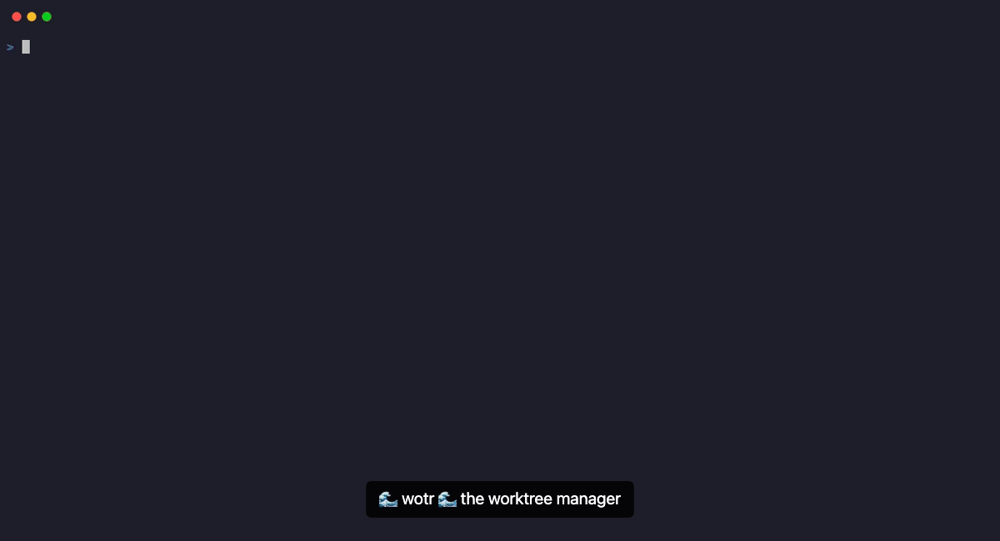

# wotr

There are a million tools for AI coding right now. Some wrap agents in Docker containers, others proxy every shell command you type, and some try to reinvent your entire IDE.

`wotr` is a simple tool built on a simple premise: **Git worktrees are the best way to isolate AI coding sessions, but they are annoying to manage manually.**

The goal of this tool is to be as unimposing as possible. We don't want to change how you work, we just want to make the "setup" part faster.

> Forked from [cwt](https://github.com/bucket-robotics/claude-worktree) at v0.4.0.

## How it works

When you use `wotr`, you are just running a TUI (Terminal User Interface) to manage folders.

1.  **It's just Git:** Under the hood, we are just creating standard Git worktrees.
2.  **Native Environment:** When you enter a session, `wotr` suspends itself and launches a native instance of `claude` (or your preferred shell) directly in that directory.
3.  **Zero Overhead:** We don't wrap the process. We don't intercept your commands. We don't run a background daemon. Your scripts, your aliases, and your workflow remain exactly the same.

## ⚡ Features

*   **Fast Management:** Create, switch, and delete worktrees instantly.
*   **Safety Net:** wotr checks for unmerged changes before you delete a session, so you don't accidentally lose work.
*   **Auto-Setup:** Symlinks your `.env` and `node_modules` out of the box via `wotr-default-setup`. Customize with `.wotr/setup`.

## 📸 Demo



## 📦 Installation

```bash
curl -fsSL https://raw.githubusercontent.com/gtmax/wotr/main/install.sh | bash
```

### The Setup Hook

By default, `wotr` will run `wotr-default-setup` which:

1.  Symlinks `.env` from your root to the worktree.
2.  Symlinks `node_modules` from your root to the worktree.
3.  Creates a `.claude/` directory with symlinked contents (isolating `settings.local.json`).

To customize setup for a repo, create an executable script at `.wotr/setup`:

```bash
mkdir .wotr
touch .wotr/setup
chmod +x .wotr/setup
```

**Example `.wotr/setup`:**

```bash
#!/bin/bash
# WOTR_ROOT points to your repo root
# WOTR_WORKTREE points to the new worktree path

wotr-default-setup   # run the built-in defaults first

# then your custom steps
cp "$WOTR_ROOT/.env.local" .
npm ci
echo "Ready!"
```

### The Switch Hook

To run a script every time you switch to a worktree (e.g. restart a dev server), create `.wotr/switch`:

```bash
#!/bin/bash
bin/dev stop-all
bin/dev start
```

## 🎮 Usage

Run `wotr` in the root of any Git repository.

| Key | Action |
| :--- | :--- |
| **`n`** | **New Session** (Creates worktree & launches `claude`) |
| **`Enter`** | **CD** (Change shell directory to worktree, no claude) |
| **`s`** | **Switch** (Run switch hook + CD) |
| **`r`** | **Resume** (Suspend TUI, re-enter worktree with `claude`) |
| **`/`** | **Filter** (Search by branch or folder name) |
| **`d`** | **Safe Delete** (Checks for unmerged changes first) |
| **`D`** | **Force Delete** (Shift+d — the "I know what I'm doing" option) |
| **`Shift+R`** | **Refresh** (Reload worktree list) |
| **`Esc`** | **Quit** |

## 🏗️ Under the Hood

*   Built in Ruby using `ratatui-ruby` for the UI.
*   Uses a simple thread pool for git operations so the UI doesn't freeze.
*   Uses `Bundler.with_unbundled_env` to ensure your session runs in a clean environment.

## 🤝 Contributing

Bug reports and pull requests are welcome on GitHub at https://github.com/gtmax/wotr.

## License

MIT
